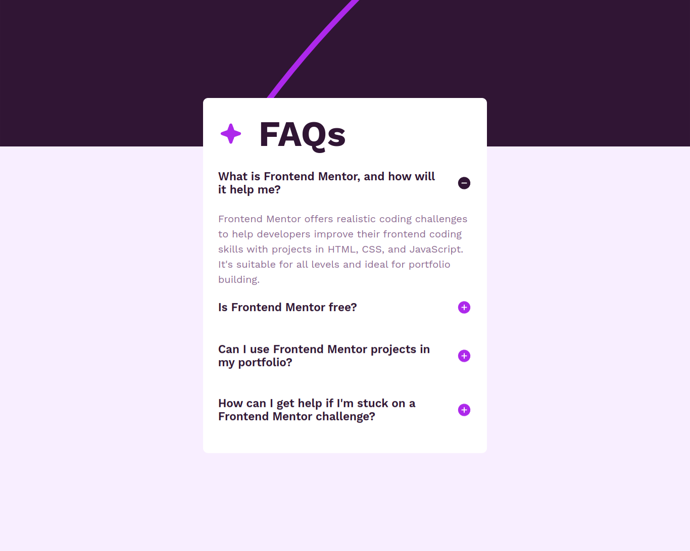

# Frontend Mentor - Faq accordion

This is a solution to the [Faq Accordion](https://www.frontendmentor.io/challenges/faq-accordion-wyfFdeBwBz). Frontend Mentor challenges help you improve your coding skills by building realistic projects. 

## Welcome! 👋

Thanks for purchasing this premium Frontend Mentor coding challenge.

[Frontend Mentor](https://www.frontendmentor.io) challenges help you improve your coding skills by building realistic projects. These premium challenges are perfect portfolio pieces, so please feel free to use what you create in your portfolio to show others.

## Table of contents

- [Overview](#overview)
  - [The challenge](#the-challenge)
  - [Screenshot](#screenshot)
  - [Links](#links)
- [My process](#my-process)
  - [Built with](#built-with)
  - [Useful resources](#useful-resources)
- [Author](#author)
- [Acknowledgments](#acknowledgments)

## Overview

### The challenge

Your challenge is to build out this FAQ accordion and get it looking as close to the design as possible.

You can use any tools you like to help you complete the challenge. So if you've got something you'd like to practice, feel free to give it a go.

Your users should be able to:

- Hide/Show the answer to a question when the question is clicked
- Navigate the questions and hide/show answers using keyboard navigation alone
- View the optimal layout for the interface depending on their device's screen size
- See hover and focus states for all interactive elements on the page

### Screenshot

### Links

- Solution URL: [GitHub repository](https://github.com/welpmoz/faq-accordion).
- Live Site URL: [Live site](https://welpmoz.github.io/faq-accordion/)

## My process

### Built with

- Semantic HTML5 markup
- SASS
- Accessibility
- BEM methodology
- Git & GitHub
- Github Pages
- Mobile first approach

### Useful resources

- [Responsively](https://responsively.app/): A best browser for develop responsive webs.
- [animation rocks](https://cssanimation.rocks/): Provide several innovative ideas for animate your project.
- [Struturing SASS projects](https://www.youtube.com/watch?v=LVXUTvJnFYQ): An option for organize your sass projects.

## Author

- Github - [Roswell Jaime](https://github.com/welpmoz)
- Frontend Mentor - [@welpmoz](https://www.frontendmentor.io/profile/welpmoz)

## Acknowledgments

I greatly appreciate the work done by the Frontend Mentor team. Their challenges are diverse and well-suited for developers at all levels. Additionally, I'm grateful for the inclusion of Figma as a useful resource.